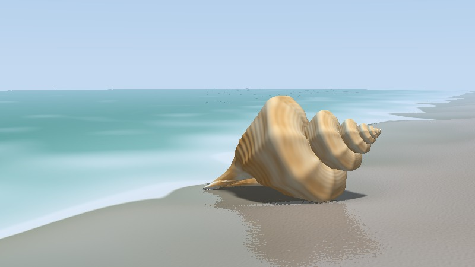
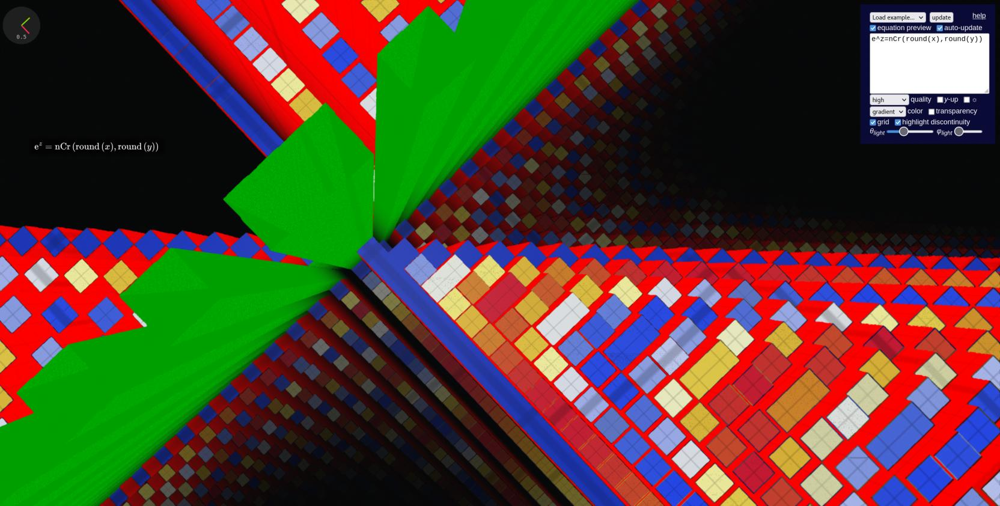
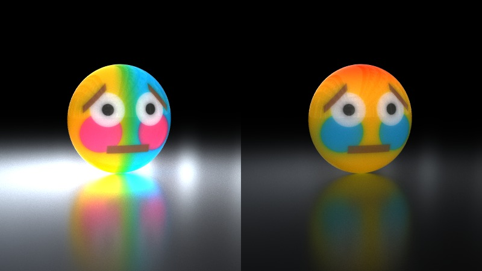

# About Me
--------

This is where you can find an overview of my position: my belief, my unique understanding of engineering design process, my values and skills and their related bias, as well as my weaknesses and my attempts to overcome them. I thought about justifying them with evidences, but I found it can be sometimes easier to follow and understand if I just state them, so I decided to leave supporting evidence to later parts of my portfolio and handbook.

If you are a member of the ESC102 teaching team, you may have already be familiar with me through various ways including but not limited to my submitted assignments and tutorial activites, and I hope this can help you see how I understand myself and engineering design. If you are just a visitor from the internet who scrolled to this page, I only expect I can show you that I'm not a "normal" person, as well as present some of my unique understandings.

A [digital rendering of a conch](https://www.shadertoy.com/view/Nt2yW3) I created in mid-2022. I enjoy programming, and I have a special fascination with beaches, spirals, and seashells.

 

# Overview

While I scoped out all information regarding my mental condition and difficulties I've faced in this document, I characterize myself as a highly individualized and reflective person. I engage little in popular entertainment activities, but spend most of my spare time on personal programming projects and experiments. I frequently reflect on activites I engaged in, connecting the results and processes, trying to find out the cause of my failure and what's wrong with me. I can notice details other people don't notice and often believe things have meanings.

I'm extremely passionate about certain areas of STEM, mostly computer programming, with specific areas like numerical algorithms and computer graphics, which I explored in my programming activities. It's possibly that I do programming because I don't have access to tools other than a laptop, and I may find other passions when I get better conditions, but at least programming is what I will answer as my hobby when being asked about. I feel I'm sometimes too passinate that I connect everything with programming, which may not always be the most suitable way.

Communication and teamwork is where I found myself difficult in. If I need to use one word to describe my situation on these, the word would be "cursed." I could say when I was in high school teams, there were only three outcomes: either I did everything, or other teammates did everything and I did nothing, or our team messed up. In university courses where we were required to work as an integrated team, the outcome is a combination of the three: we divided our tasks and work on our own, and at the end there was lots of discrepancies in our team. I reflected on observations of our communication and came out with lots of potential causes and fixes, but I just kept messing up, and I seem to be the person bringing curse into every team that I'm in.

Based on my individualized background, I personally view engineering design as a fun activity where I find challenge, and I found enjoyment working on them for passion and possibly kill time, but I don't have much expectation for it to be practical or beneficial. I sometimes feel the need to isolate myself from society so I can enjoy my own design activities, without bringing curse to any team who does engineering design for a "conventional" purpose.

Sunnyside beach. During the Praxis II design activity, I visited the beach 4 times (3 times on my own) to collect information and test prototypes. My final design has an outstanding performance, but our showcase presentation was poorly organized, and there were lots of discrepancy among team members.

 

# Engineering Design: An Optimization Problem

Combining what I learned in the Praxis courses and my experience in personal programming activities, I present my understanding of engineering design as an optimization problem. I couldn't find a description of a similar analogy elsewhere so I consider this as my unique understanding.

In applied mathematics and science, a common problem is finding the extremum of a mathematical function. For example, in aerospace, one would try to maximize a function that takes the amount of fuel in each layer of a rocket and outputs the height traveled; In finance, one would try to maximize a function that takes the price of a product and outputs the net profit; In CAD modeling and graphics design, a program would try to minimize the error between a smooth spline and a hand-sketched path. Some optimization problems have constraints, like the amount of fuels in each layer must be non-negative, and the spline must start and end at specific points.

Given a function where you want to minimize (or maximize, but here I use minimize by convention), one way to solve the optimization problem is [gradient descent](https://en.wikipedia.org/wiki/Gradient_descent): if you know the direction the function goes down, just keep going in that direction and keep going down until you can't go down anymore, and you arrive at the minimum.

</img>
</img>
</img>

*Left*: how gradient descent arrives at the minimum.
 
*Middle*: a function where the global minimum can be arrived at through gradient descent.
 
*Right*: a function with many local minima, gradient descent would find a poor local minimum instead of the "best" global minima.

However, []

 - Mathematical optimization: find a global minimum
 - Can be quantized through framing, but not required
 - Go fast -> not optimal
 - FDCR: genetic algorithm
 - Iterative design: gradient descent
 - Judgement before testing to save effort

 

# Values and Skills

I consider some of my strong areas to have contributed to my success in individual work. I summarize them by my strong intuition, strong motivation, and self-reflection.

**Strong intuition.** I have a strong intuition and common sense in fields including but not limited to STEM. This made me understand how things work easily, both theoretically and empirically; and after I understand the background mechanism, I can easily tell potential benefits and issues of a technique or approach and how to reduce issues. I believe this ability has contributed significantly to my success in independent projects and problem-solving activities. My intuition also made me learn new things fast and easily adapt to tools created by someone else even with little documentation, which made me quickly learn tools ranging from hand tools to household appliances to CAD software to programming interfaces.

**Strong motivation.** I am enthuasiastic in numerous areas of STEM. I enjoy trying, testing, and exploring STEM techniques by my own hand, but I don't reject theoretical understanding and divergent thinking activities. While my experience is mostly limited to software due to material restriction, previously I also enjoyed activites related to mechatronics and chemistry when I got the materials. My enthuasiasm not only made me spend most of my spare time exploring STEM but also made me maintain my interest throughout a number of school projects.

**Reflection and contemplation.** I consider myself a reflective person. When I feel I need a break from STEM activities, I often start reflecting on myself without intentionally trying to do so. I often come out with unique understanding of things and insights into my previous failure experiences, which helped me apply suitable techniques and potentially avoid similar failures.

These values and skills contributed to some of my biases. My strength and passion in computing made me approach many problems from a programming perspective. An example is my understanding of engineering design as an optimization problem, which is also the result of my contemplation.

3D landscape of the [combinatorics function](https://en.wikipedia.org/wiki/Binomial_coefficient) visualized in real-time on the GPU, rendered with a web tool I programmed completely from scratch without dependency.

 

# Weaknesses

My numerous noticed weaknesses are related to my values and skills, plus communication and managing conflicts. Attempts have been made to overcome these conflicts and maintain my optimism for the outcome of engineering design activities and personal development.

**Hyperfocus.** I consider hyperfocus to be my greatest weakness in completing projects. I cannot count in how many assigned and projects I became extremely enthuasiastic in one aspect and overlook the overall requirement, and similar cases also happened in personal projects. I often do an assignment without carefully reading the instruction, and start prototyping and testing without going through much secondary research and analysis. I think my strong intuition can worsen this, because it made me not approaching concepts and tasks rigorously and systematically, and therefore I spend more time trying to figure out the less important parts.

While my reflective nature allowed me to notice this issue, my attempts to fix it has not been successful. I had short memory if I force myself to read the task requirements. I've tried framing the requirements and setting timers for each part, which worked for several days, but then I couldn't resist the temptation to ignore the timer. I also tried putting my least favorite task first in my to-do list, but I found if I force myself to do something I don't like doing I often stare at the screen or paper doing nothing for hours, and I ended up only mess up my daily routine without getting anything done. I recently tried planning tasks by following a general to specific streamline and use a random number generator to decide the order to implement each part. While this strategy did help controlling hyperfocus, I feel with this strategy it is difficult to make changes if I notice fundamental issues.

**Communication.** As mentioned, I use the word "cursed" to describe my communication. Since I could remember thing I couldn't communicate properly and am often both misunderstood others and made others misunderstand me. This is especially a problem when I need to engage in engineering design activities in a team where psychological safety and diverse feedback is important. I find it difficult to keep a middle ground between inaction and make people feel I'm aggressive, and I often don't get people's emotion toward me if they don't explicitly state. Previous experiences tell me what I can do for a deliverable team product is either inaction or complete domination, and attempts to integrate each other's conflicting opinions would almost always mess things up. While this may sound against the norm, it was what has been validated to work the best for me in team activities.

Another digital rendering I created by writing [code](https://www.shadertoy.com/view/mlBXRd). It took me about half an hour to create it, when I was slacking during an early Praxis II meeting after midnight, after I decided not to give any input to my team but was bored of watching other team members working.

 

# Position Statement

I am an engineering student with a strong skill and enthuasiasm in programming. I am experienced in computer graphics and numerical algorithms through 5 years of indepedent experimenting and exploration. My biggest strength is my strong intuition and learning skills. While I often think solutions from a programming perspective and can easily concentrate on my passion activities, I frequently reflect on the causes behind outcomes and seek improvement.

 
