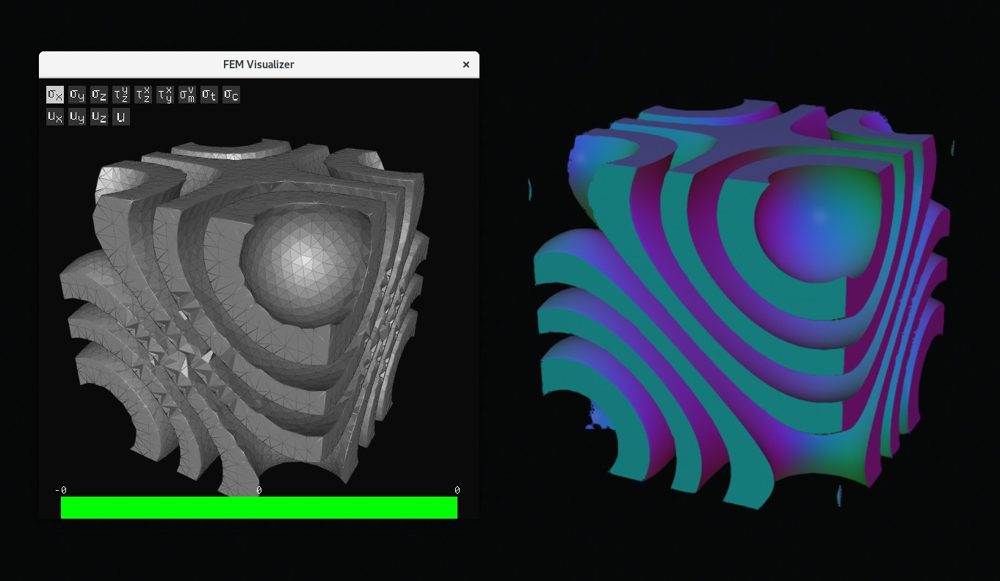

<h1>Personal Engineering Design Processes</h1>
--------

Focus on examples helpful for TMF, not reflection.

 

# Framing
 - Understanding what is a good design
 - Want to make web app
    - Mesh: low ratio (research why it's good; log det as metric, better than strain), speed
    - Spirula: rendering speed and accuracy; fps & visual judgement
 - Working with stakeholders
    - Understand what features people (I) need for a matrix visualizer
 - Some numerical metrics are simple; Bridge project: FoS, overall is min of all; Detailed objectives
 - "Good" metric to help converging and for presentation: glass fogginess
 - Some not too simple, holistically/pairwise comparison (ex. volunteer experience)

 

# Diverging and Converging
 - Global optimization, need diverse feedback
 - Done in teams: two praxis ones, brainwriting
 - Individual: much easier to fall into dead spots; research reference designs for diverse startpoints; Sometimes need force doing research to fight temptation to try own (optimizing marching cubes & edge splitting didn't work); Add novelity based on secondary research (trust region for mesh optimization)
 - Attribute listing: nurdle/wood
 - Biomimicry: glasses
 - Previously (glasses, camera) unbelievable ideas with little secondary research didn't work well, might eliminate if no much secondary research if there's no effort to prototype/test
 - Pairwise comparison mostly match intuition (nurdle), but logically it has potential to reduce bias
 - Pugh chart: worked for praxis I final, not suitable for lots of objectives
 - Manage lots of objectives: 
 - Make sure other objectives are met in not too detailed design; Test and compare specific objectives in detailed design (nurdle)

 

# Iterative Design

Despite not being a focus of the praxis course, iterative design is a large part of my engineering design activities done so far, in both my personal programming projects and the nurdle filter in Praxis II. I found the term "iterative design" by describing my design process to ChatGPT. According to [Wikipedia](https://en.wikipedia.org/wiki/Iterative_design), it is characterized by a cycle of prototyping, testing, and refinement.

As someone passionate about creating things and see them work in practice, iterative design has naturally become a large part of my personal projects. The shading model for Spirula was tweaked during iterations of testing to achieve visual clarity and aesthetic. The FEM mesh generation tool was tested to reveal unexpected issues, and attempts to fix the issues were made.

The mesh generation algorithm described in the [paper](https://graphics.stanford.edu/papers/meshing-sig03/meshing.pdf) was tested to be slow and have ambiguity issues. I proposed a technique based on trust region to speed up mesh compression, which was tested effective. I also made several attempts to detect and resolve ambiguity.

In Praxis II, the SCAMPER methods were used to change the hydrodynamic separator in stormwater treatment to a solution based on a water bucket and filtering meshes. I decided to directly prototype and test the design since it wasn't difficult. As testing revealed unexpected issues, I made adjustments to fix the issues, with either a diverging-converging activity or what came into my mind.

</img>
</img>

Testing of nurdle filter shows wood debris can also pass the filter. I responded my making an filter consisting of multiple layers of meshes, where wood can be caught by the rough walls inside holes, while spherical nurdles can still pass smoothly.

 

# Verification and Validation
 - Framing can be inaccurate (ML camera), direct validation if not too difficult (ex. algorithm like mesh, nurdle)
 - No metric: validate by interviewing AGF
 - Verification: measure glass fogginess and airflow to get metrics for converging

 

# Presentation
 - 