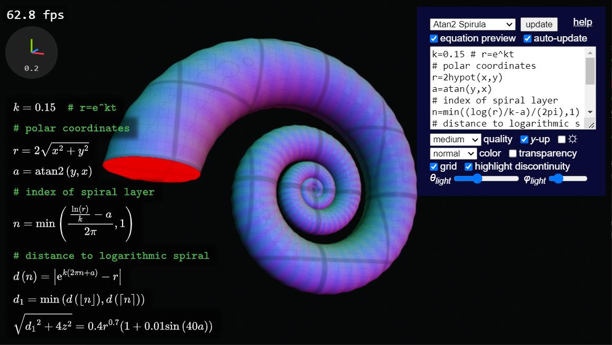
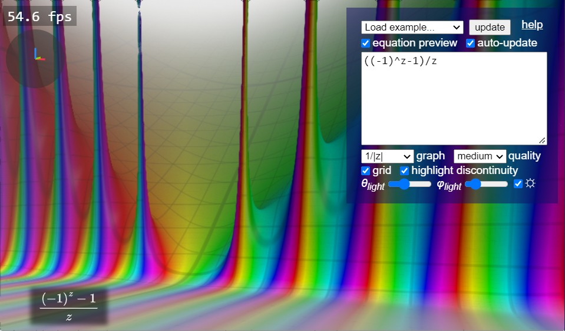
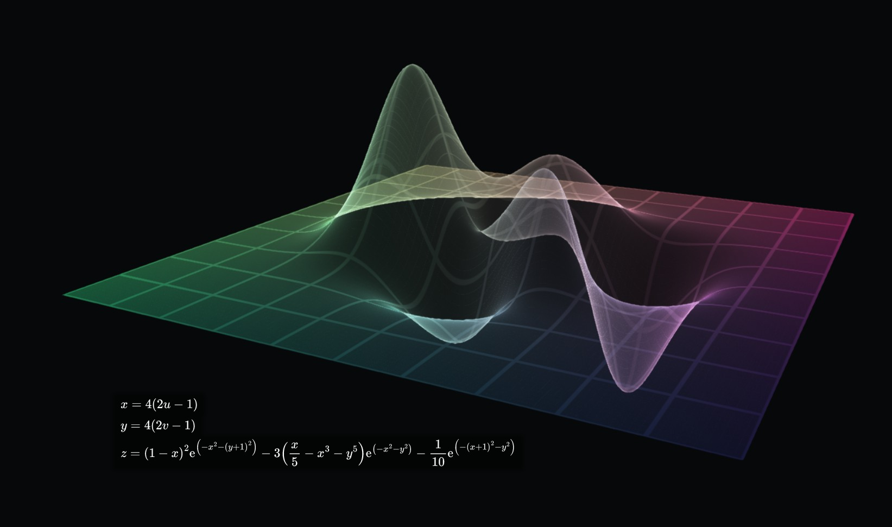
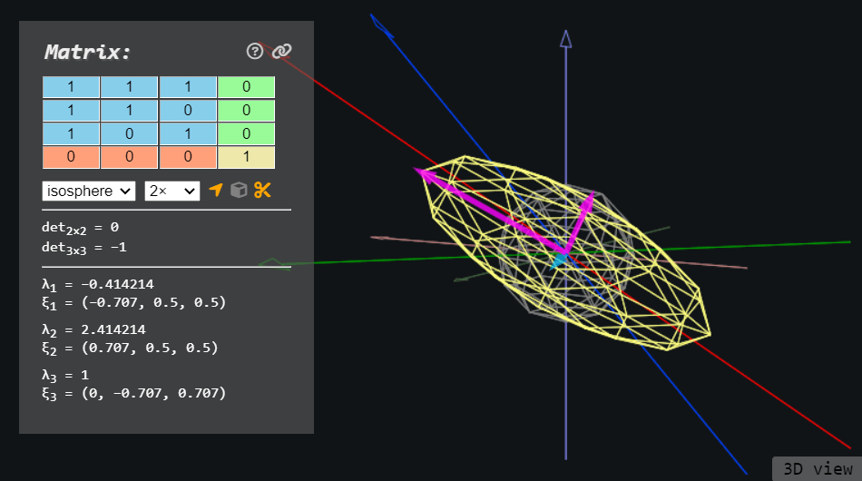
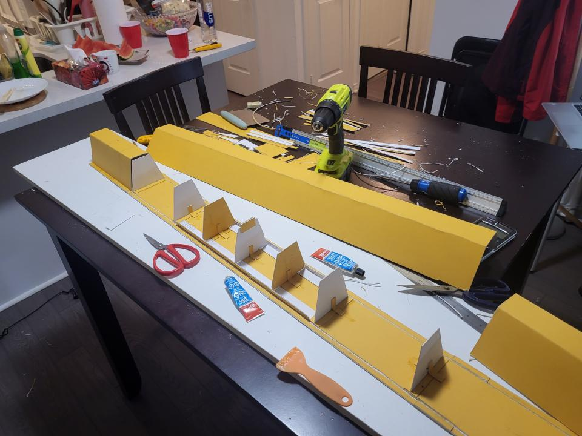

<h1>Personal Engineering Design Products</h1>
--------

This page lists the products of my engineering design activities in the past year, since September 2022. As per assignment requirements, I write this page to present what are done to an external audience with no prior knowledge of the projects. While not focusing on the process and takeaways, I intentionally connect them with my positions mentioned on the previous page, including my personality, strengths, and attempts to overcome my weaknesses.

 

# Personal Programming Projects

As mentioned in my about me, I created a lot of personal projects purely out of passion and to demonstrate my skills to myself. Most of them are not stunning products but focused on what I "like" rather than what I "need", and therefore a lot of them are experimental and ongoing. I don't have a particular goal for them, and I feel I'm more free when I don't have to work toward an objective, which can be hard to achieve due to hyperfocus. I also have multiple projects running at the same time and frequently start new projects, since I may become bored at one project, and I can always choose to switch back later. Some noticeable ones in the past year are the Spirula function grapher, the FEM mesh generation experiment, and the 3D matrix visualizer.

 

## Spirula Function Grapher

The [Spirula function grapher](https://harry7557558.github.io/spirula/) is a web-based tool that instantly renders user-input mathematical functions. The interface is very simple: the user enters a function on the box on the top right, and the tool displays it. It supports explicit, implicit, and parametric equations, as well as functions defined in complex domains.

I created it out of my passion in computer graphics, my need for fast visualization of 3D implicit surfaces, and the lack of such a tool I can find om the internet. I have been maintaining and constantly updating this tool since April 2022, for my demand for additional features during use and as passion activities: it initially only graphs 3D implicit surfaces, but I implemented complex domain coloring in 2D and 3D in October 2022, updated the parser in January 2022, added support for parametric surfaces in February 2022, added several non-elementary functions in March 2022, and I still have plans for more functionality like automatic differentiation and exporting 3D models. I like how this project has different parts requiring different knowledge and techniques, allowing me to switch between them and reduce mental fatigue.

A function over the complex domain graphed in Spirula

Other they me enjoying the creation process, the product has benefitted me in unintentional ways. I often use Spirula as a tool to create artworks: since I'm weak in communication and often experience frustration, I use 3D modeling artwork as therapy. I would say it's much more effective than most traditional and digital arts that can take a long time to see the result: Spirula renders it immediately as I update an equation, and there's still rooms for me to tweak the parameters and refine the results. I share the results on social media and received positive feedback, which I think have improved my confidence over my programming strength. While there are numorous thankful emails and feature requests from people who found my works on the internet and benefit from them, and they inspired to create more functionality like animation, I still view this tool as something I created for myself and became proud of my ability.

</img>
</img>

Some artworks I created using Spirula.
 
*Left*: a jellyfish created through the parametric surface grapher
 
*Right*: the Mandelbulb over toric coordinates through the implicit surface grapher
 
*Bottom*: X-ray mode of the parametric surface grapher based on the [physically-based X-ray model](https://en.wikipedia.org/wiki/Beer%E2%80%93Lambert_law)

 

## The Matrix Visualizer

I created the [matrix visualizer](https://harry7557558.github.io/tools/matrixv.html#) in 2019 to visualize matrix transformation when I just started learning linear algebra. The internal algorithm of the tool was heavily updated in November 2022. It visualizes 2D and 3D transformation matrices as well as 4D affine matrices. It has computation of determinant and eigensystem and visualization for eigenvectors. It also allows users to try different models with varying symmetry.

I was researching the QR eigenvalue algorithm for another personal project, and I decided to update this tool as an exercise, and considering it's "grade-school" eigensystem computation was very unstable in practice. The updated algorithm was much more robust over arbitrary user inputs and edge cases, and the addition of the sphere model reduced anisotropy in visualization. According to Google Search Console, the tool received more than 2,000 Google search clicks in the past 3 months, confirming the impact of my technical strength.

Interface of the matrix visualizer. I implemented link sharing after seeing the popularity of my tool. You can see an example here: [http://harry7557558.github.io/tools/matrixv.html#m=1,1,1;1,1,0;1,0,1&g=isosphere&s=2&tf=0](http://harry7557558.github.io/tools/matrixv.html#m=1,1,1;1,1,0;1,0,1&g=isosphere&s=2&tf=0)

 

## FEM Mesh Generation

Inspired by the CIV102 course, I started a new programming project about structural analysis during my winter break, and I soon sticked to the [Finite Element Method (FEM)](https://www.engr.uvic.ca/~mech410/lectures/FEA_Theory.pdf). Part of FEM in 3D is generating a tetrahedral mesh that avoids tetrahedra with high aspect ratio. Since mesh generation is also required by my several other projects including but not limited to Spirula, I spent a while researching mesh generation techniques.

The project is still ongoing in parallel to my several other projects, since I'm eager testing my capability but I don't want to grow bored. On the FEM part, I tested elements with different shapes and orders on several easily parameterized shapes. On the mesh generation part, I scoped my design space to mesh generation on implicit shapes and got some pleasing results. Considering the result section of numorous research papers and my try on similar tools I found on the internet, I think the mesh generation technique I'm working on can have a great potential for its high speed and mesh quality.

</img>
</img>

*Left*: a graphics interface I created to visualize stress in an irregular beam computed by my FEM code
 
*Right*: a screenshot I took while testing my mesh generation technique

 

# Praxis II: The Nurdle Filter
 - Background: AGF
 - Features
 - Passionate about

 

# Praxis I: Foggy Glasses Solution
 - 

 

# CIV102 Bridge Project

While my overall experience with this course project is negative, I still want to mention my final project for this civil engineering course in my portfolio. The project is about designing and building a bridge with a single sheet of matboard paper, and the bridge will be tested against a heavy moving model train. The project was done in a team of 3 members, and programming was required for evaluating the design.

Despite a large percentage of the assignment evaluation factor is the documentation and presentation of the design, driven by passion, I coded an optimization framework completely independently from scratch to optimize the model. My code represents the bridge in terms of several parameters, evaluates the factor of safety of numerous failure modes and take their minimum as the objective to maximize, and optimizes the objective with respect to parameters subject to the constraint that the required materials must fit into the given matboard paper. The optimization was first done through my modification of the [simulated annealing](https://www.cec.uchile.cl/cinetica/pcordero/MC_libros/NumericalRecipesinC.pdf#page=468) algorithm to take gradient into consideration, and then refined with SciPy's optimization routine.

The layout of how the matboard will be cut generated by my optimization program. In the [exported page](https://harry7557558.github.io/engsci-2t6/civ102-project/design_nd.html#7105), information of an component is shown when the mouse hovers the component.

I chose an inverted trapezoidal cross section in contrast to rectangular like most other teams did, based on my intuition, secondary research, and analysis done by my program. However, this lead to a deadly failure mode not taught in the CIV102 course, which I didn't notice until two days before the bridge testing, after we finished building the bridge and submitted the design. During testing, the bridge passed a 400N load but failed at 550N due to the same failure mode as late noticed. We received a poor grade on presenting the design because most of the effort was spent on optimization via programming, which was not part of the project evaluation rubric.

The bridge building in process, which 3 members pulled an all-nighter to work on

