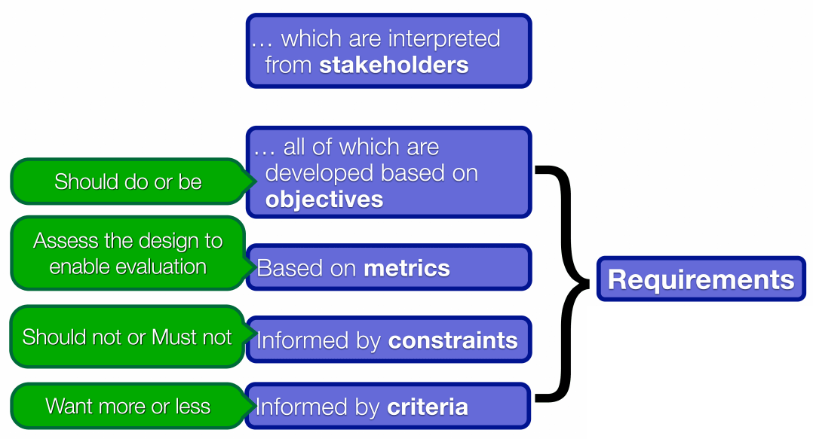
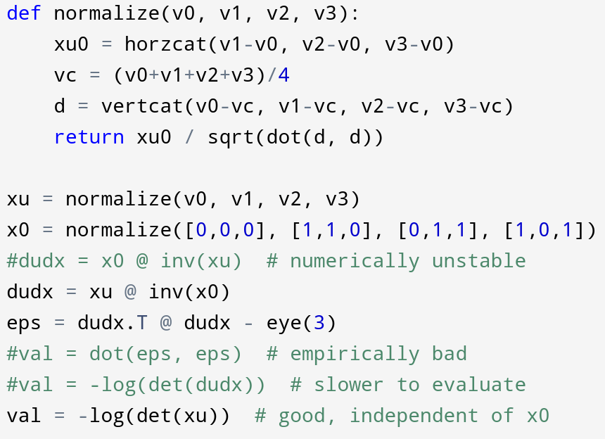
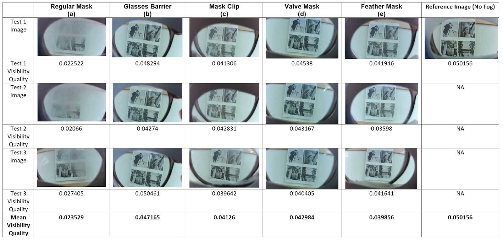
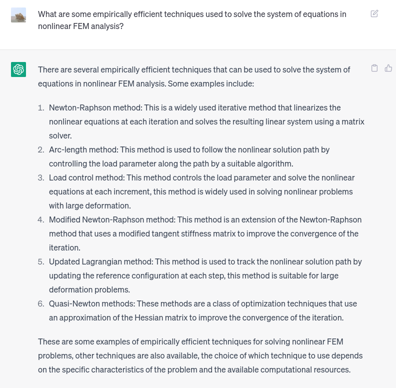
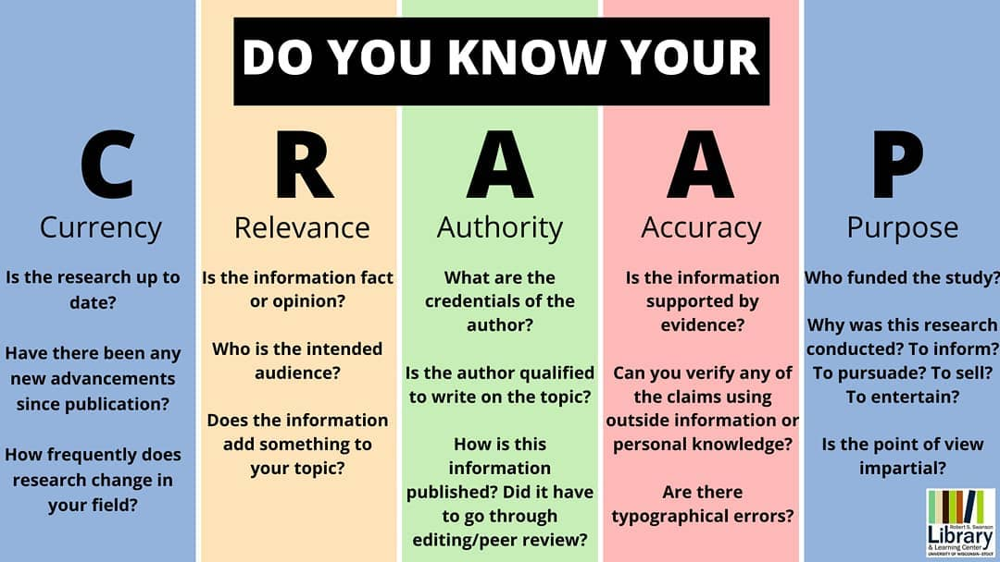
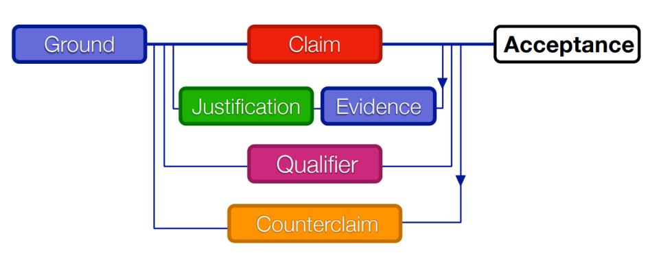
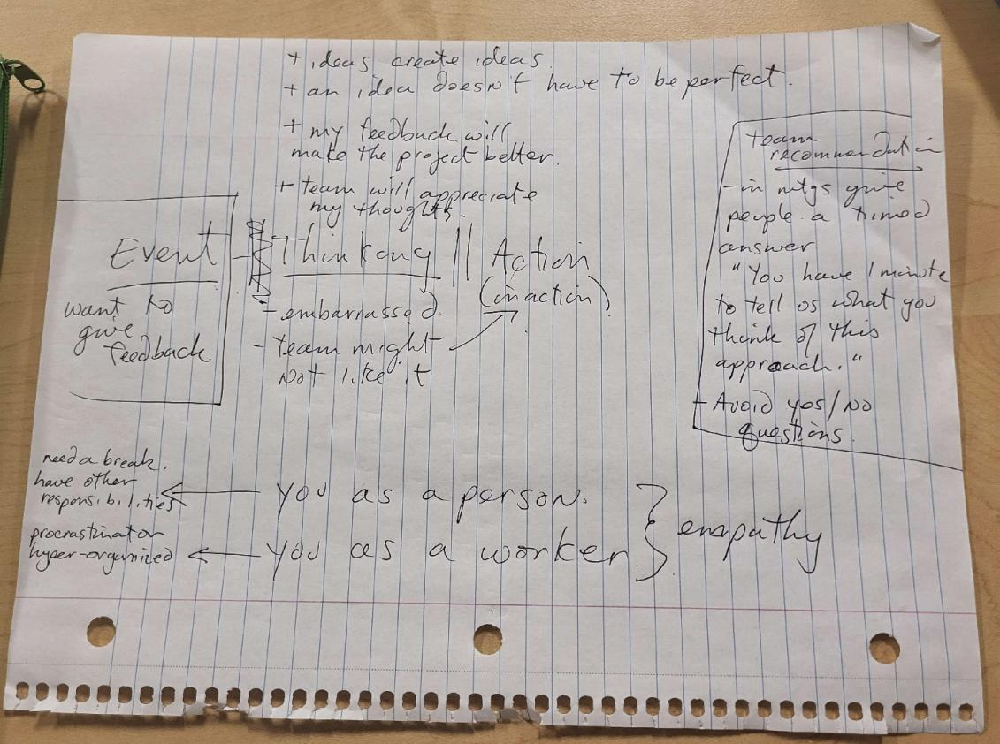
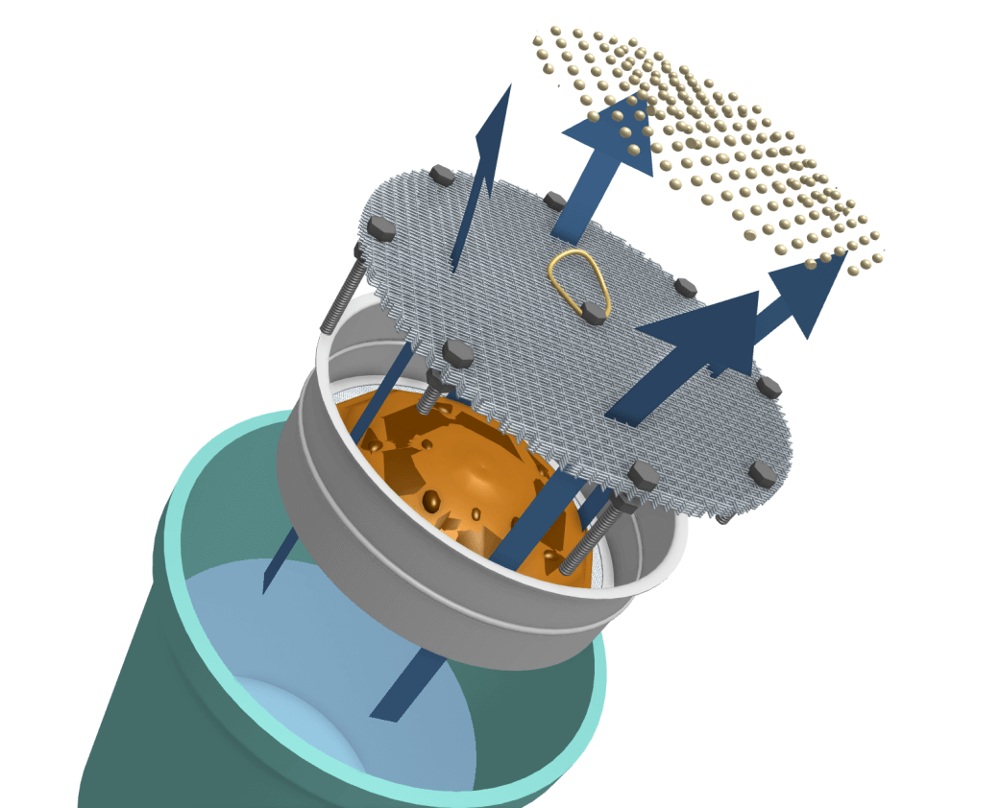

<h1>Tools, Models, and Frameworks</h1>
--------

This page lists the models and tools that I have used before and would like to consider for future use. Based on my understanding of engineering design process as an optimization problem, I order them by the steps of engineering design: framing, diverging and converging, iterative design, and communication. I chose to put communication in a separate section considering I'm an individualized person whose previous engineering design expereinces are done on my own. Reflecting on my past success and failure experiences, I found many of these TMFs controversial, and I evaluate them and argue their effectiveness with logic and evidence.

 

# Personal Engineering Design Models
 

## Hoover Dam
 - Transform real world -> models, models are easier to solve and analyze
 - Evidence: UTAT, personal projects
 - Useful when the problem can be easily math'd; (robotics, scientific computing, CG)
 - Not good for lots of human factors
 - Issues: framing can be inaccurate, unexpected issues; Need to leave something to validation

 

## Framing, Diverging, Converging, Represent
 - Global optimization done by humans
 - Divergence: avoid bias and blind spots, usually done in teams; Individual: research reference designs
 - Convergence: eliminate through research/analysis, analogous to shortcuts/interpolation for numerical optimization
 - Negotiate objectives during diverging and testing
 - Make more detailed/specific through iterations (refinement in optimization)
 - Be patient, too fast -> bad results

 

## Requirements Model

As a model used in the framing strand, the requirements model frames stakeholder requirements into a list (and sometimes hierarchy) of objectives, which each include numerical metrics, criteria mapping metrics to utility, and constraints deciding whether a solution is feasible. I understand this from how I understand engineering design as an optimization problem where the total utility is to be maximized, subject to hard constraints that must not violate and soft constraints that penalty the utility. While in an engineering design activity done by humans, making the objectives can encourage better understanding of stakeholder needs and give directions for divergence for convergence.

Since numerical metrics are necessary for optimization algorithms used by computers, I've been doing framing works for my programming projects. One example would be an optimization in the mesh generator, where I want each tetrahedron to be close to regular, and I model the utility of an element as the logarithm of its volume after normalization to a specific size, which empirically gives a much better result than a stress-based metric like used in several papers. The constraint would be that the signed volume must be non-negative, otherwise the logarithm would be undefined. Another example is the CIV102 bridge project, where I tried to maximize the overall factor of safety to meet the objective to loading more weights.

The code for the metric for the "goodness" of a mesh element, along with other metrics (commented code) that didn't work as good. This demonstrates how the choice of a metric can affect the optimization result and process.

In human-delivered engineering design activities, the metric in the requirements model has been proven useful for verification. For example, when testing foggy glasses solutions for Praxis I, I found a metric for the visibility (in contrast to blurriness) of digital images through secondary research, and my team conducted test for four cardiate solutions. The metrics were used in Pugh charts that helped us converge to a final design.

However, overall in praxis courses, I found the metrics can be not helpful and unnecessary, and they can even make verification more difficult and less representative. We spent some time researching metrics when writing the design brief and the RFP. And when working with other people's design brief and RFP, we found metrics to be difficult to test and don't accurately model the design objective. For example, the nurdle RFP used force required to operate the design as an metric for physical strain, but in testing we found holding a hand shovel can be tiresome even though little force was required. And we could not access the cited research for a so called "material sustainability index." At the end, we had to reframe the objectives and leave some testing to validation instead of verification.

Based on these experiences, I conclude that while framing requirements into objectives can benefit engineering design in many ways, the choice on a metric and whether a metric should be used depends on the case. In the case where there are multiple cardiate designs and there are research showing the effectiveness of a metric on the situation, a metric that is easy to test can greatly help convergence. However, if finding a representative metric is difficult (which is common for objectives involving human factors), one may consider finding other ways to converge and verify/validate the solution. Even if a metric is needed, engineers still need to figure out a metric that is representative and easy to measure.

 

# Personal Engineering Design Tools

 - https://dhrumil0902.github.io/portfolio/handbook.pdf
      - Purpose, how, example, advantage/disadvantage (list)
 - http://xueqilin.me/engsci-2t4/esc102/handbook.pdf
 - https://raw.githubusercontent.com/JLefebvre55/ESC102-Handbook/master/Handbook.pdf

 - https://www.peterfisk.com/wp-content/uploads/2016/01/27-Creativity-Tools-for-Divergent-and-Convergent-Thinking.pdf

Follow an order of design process (after understanding the problem)
 - Do some individual brainstorming (biomimicry, attribute listing, lotus bloosom, etc.) before secondary research to avoid anchoring
 - Generate a variety of ideas through brainwriting

 

## Biomimicry
 - Inspired by nature; Nature is good at optimization;
 - Suitable for me, it's an individual acticity itself, and I'm a fan of nature
 - Advantages: take a mental break
 - Think similar problems in nature itself is a diverging activity?
 - Examples: simulated annealing for CIV; valve mask;

 

## Secondary Research

A large fraction of my engineering design activies are personal projects, which are done on my own and lack the diverse inputs of a team, and therefore I seek diverse inputs though secondary research. While many industrial text are not publicly available (like the ISO-10303 standard that I needed for a personal project), and therefore access to a research database is important, research papers, standards, and documentations in software industry tend to be openly accessible and can be easily found through a web search. In the past months, AI technology has made secondary research incredibly more convenient, or specifically, ChatGPT can find search terms and list reference solutions with simple descriptions and prompts.

ChatGPT can list existing solutions to a problem with their applicable cases from a simple prompt. While the accuracy of the descriptions can be questionable, the names of the solutions listed are valid search terms for both Google and university library.

No matter what search tool I use, a common problem is judging the effectiveness of a reference solution I found so I can decide what to do with it. While many software-related papers that introduce techniques have a section for testing results, they are often not suitable for comparison due to different testing procedure and the rapid development of hardware performance in the past years. I've tried to use citation count as a metric, however, I found an once influential but outdated paper can often have much more citations compared to a recent paper. Based on what I observed on the resources that really helped me, the CRAAP test (especially Authority and Currency) roughly filter out such resources. However, there are always exceptions, like there are several times I found a personal blog more helpful than a proceeding to a recognized conference. And considering the nature of a reference design, I sometimes judge a technique by novelity and the possibility of building other techniques on it, rather than its practical effectiveness.

The CRAAP test. Image source: [UW-Stout University Library](https://www.facebook.com/UWStoutLibrary)

 

## Brainwriting
 - description
 - Use: praxis I, early praxis II
 - Advantages: a variety of inputs, reduce fixedness; timed manner, stimulate ideas
 - Disadvantages: done in teams, can be tiring and therefore do whatever looks "good"

 

## Functional Decomposition

 

## Pairwise Comparison & Pugh Chart
 - Used for decision making
 - Practical consideration: don't always rely on metrics

 

## SCAMPER
 - 

 

## Prototyping: Programming
 - Advantages: no additional material/space, I'm experienced in, resources are openly accessible

 

# Communication:  Toulmin's Model of Argument

Like taught earlier in Praxis I, the model of arguments consists of ground, different types of claims, justifications, qualifiers, counterclaims, etc. When use in practice, like presenting my idea or suggestion to my teammates, I mostly understand it as when I give an argument, I need to give clear claim(s), justify it with evidence and methods of proof, and sometimes point out where the idea and suggestion is applicable and where it isn't.

I found the practical effect of the model of arguments to be controversial. I feel in a team without much discrepancy in knowledge (like my design team in UTAT), using such a model is unnecessary, because all members can immediately get the idea without much misunderstanding when an suggestion is pointed out, and following a standard way can instead make communication lengthy and therefore unclear and make the situation awkward. However, considering my weakness in communication throughout my course project teams, I feel it's worthy to keep such a model in my handbook.

The model of arguments indeed helped me in praxis courses. Earlier in praxis I, I tried to give feedback to my teammates by stating the problem I notice and potential fixes, but little of them were understood and considered. Team members would just say it's not a good idea for whatever reason and continue their discussion, or even without such an explaination. The setbacks made me learn not to give feedback and keep ideas to myself, which was the case for a large part of praxis I and earlier praxis II. I honestly thought my ideas aren't pointless and can sometimes even save a day, but I was just afraid to communicate them, only because I tagged myself to be poor at communication.

I started using the model of arguments after strange (possibly delusional) experience. I rememeber the time I used it was in praxis II when we were discussing about scoping the design space, where other teammates were anchored to scoping to nurdle collection, and I can't remember much details about their reason. I gave the claim that we should focus on separation instead. I told them based on our diverging activity done in the previous day, separation has a much larger solution space than collection, and there are a variety of reference designs available that covers different technical area, and every team member should be able to find the part they are enthuasiastic about. In contrast, many reference and diverged solutions for collection don't meet the objectives, and there isn't much room to do better than the existing solution. And while one member tried to argue, everyone soon saw the potential of separation, and we agreed we'll focus on separation while not completely abandon collection.

Notes from a teamwork strategist I received after talking to the teaching team in the middle of praxis I. It was almost lost until I unintentionally saw it several days ago and became thoughtful.

I continued to intentionally provide feedback justified with logic and evidence in later team activities. However, I soon noticed the issue: my team members prefer give only the main point to keep it concise, while I sent long messages, and they often just passively agreed, and I seem have become the dominatig member in the team. While I tried to ask them for feedback with questions like "what do you think?", they usually just answered "good", occassionally asked questions about details of the plan that are trivial to answer. Two teammates were responsible for making the poster and constantly asked for feedback. While I continued to write long messages to justify my feedback, they tend to give a thumbs up reaction without commenting on them or taking them into practice. They also asked teaching assistants for feedback, and some of the TA's feedback overlap with my earlier feedback, which made me doubt whether I communicated clearly enough, or if my teammates just ignored my long "essays."

The conflict occurred during the weekend before the showcase on Monday. I know the objective of the handbook is not telling a long story, but I feel there's a need to clarify this. On Friday night, my teammates were working on the poster, and I had an assignment for another course due midnight, and I promised them I'll look at the poster and try to improve it after I finish the assignment. They gave a thumbs up reaction in the text chat like they always did. However, at midnight, I looked at the poster and tried to give feedback, but I found other teammates working intensely on the poster that I couldn't find a good way to interrupt. And I waited for them to sleep and started working on it at about 4am.

I kept the text but completely redesigned the visuals based on both the TA's previous feedback and my opinion. I did so because I felt the poster is stuck in the state analogous to a local extrenum in optimization, and I thought I need to bring it out by starting from a new point. And I updated the image of the design to make it accurately represent our final design, since previously I was hyperfocused on refining the design and didn't communicate much with my teammates, and they seemed to not get how the design works. I worked until about 8am in the morning, until I saw my teammate's message that they are going to send their design to the printer. And I immediately presented my almost-finished new design.

All of my other teammates immediately became angry, saying they stayed up for several nights on their poster, and I came out with a new design to compete with them. I explained that I only tried to make our showcase better, but they cut off saying they didn't want to take the risk because they already got approval from the TA for their design, despite not being perfect. I sent my design to the TA asking for feedback, and before I got a reply my teammates paid money for the printing. The TA replied in the afternoon, criticized me for "creating a competing poster", and told me it's something I should decide with my group.

I had a good cry for the entire afternoon and didn't do any work for my team. When I explained the situation to my mother, she immediately told me she'll give me money to print my poster without me even mentioning more detail, which made me feed worse considering my family's tight financial condition. And my mental breakdown continued for the Sunday morning and afternoon. In the evening I had to go back to my team because the showcase was the next day, and we had conflicts again on the order of presentation and couldn't agree on one idea, and I pulled another all-nighter making the slide. The showcase was done without a complete rehearsal, and we displayed lots of discrepancy in our knowledge. In the team feedback, I was bombarded by blaming, saying I made my team less phychologically safe and I "forced" them to use my presentation slide, which I didn't mean any. I thought about explaining to them, but I was afraid that such attempt will only make things worse, plus one of my teammates blocked me on social media.

CAD rendering for the poster I created at the night between that Friday and Saturday, several hours before the conflict occured.

When I reflect on the cause of this conflict I thought it started with my hyperfocus on improving the design after our explicit task division. Arguing with justification definitely contributed to having people taking thumbs up as accostomed, since it made the message lengthy that people didn't want to read, and therefore communication was not delivered into practice despite my explicit attempts to engage discussion and feedback. While I consider the later part to be largely misunderstanding, the problem would be less serious if early communication was more effective. Despite I try to avoid blaming others, I think my teammate's earlier passiveness and lack of feedback is also part of the cause.

--------

Based on my past experiences with the model of arguments, I concluded the circumstances when it is feasible, as well as attentions required for delivery. Here I list them below.

<u>Justifying with logic and evidence can be helpful when (and in the opposite case the argument should be kept straightforward):</u>

 - **The team is short-term with unfamiliar members.** I observed that highly effective arguing can result in domination and make the team less psychologically safe, which is necessary for a long-term team where mutual trust is important. The negative impact on psychologically safety is less critical for a temporary team.

 - **All team members are willing to argue and give feedback.** When everyone is willing to argue due to a small discrepancy in required knowledge/skills and high confidence, the imbalance between domination and accommodation will be less a problem.

 - **A domination would be beneficial based on consideration.** In case a team has members specialized in specific areas, a domination with effective arguing can enable the member to show his/her strength and benefit the team. However, this needs to be done after subjective consideration of other member's opinions and delivered carefully to minimize conflicts.

 - **The communication is done through text.** I feel humans tend to have short memory in oral communication, and many points can be missed in an oral speech. In a text communication tool like online chats and email, people can read back to understand the components of an argument and take time to consider. For an oral meeting, presenting the ideas in text beforehand can potentially benefit.

<u>Some attentions need to be paid to during and after arguing:</u>

 - **Keep the message concise.** If the message is too long or has too much information, audiences can become tired and sometime don't even read the message. It can be helpful to point out the claim first because I feel audiences have more impression on the first point.

 - **Encourage open-ended feedback.** Encouraging open-ended feedback can motivate audiences to think about the problem, and specific questions about part of the argument can help understanding. While I haven't tried it yet, I learned from a teamwork strategist that asking for feedback in a timed manner (ex. "You have one minute to let me know what you think of this idea") can have stimulating effects.

Considering these tips are largely concluded from my failure experiences and have not been validated in practice, as well as my born weakness in communication, these tips likely need to be adjusted and/or replaced based on their practical issues, which can be tested during future teamwork activities. Communication and teamwork with continue to be something that I need to experiment with and improve on during their use in practice.

