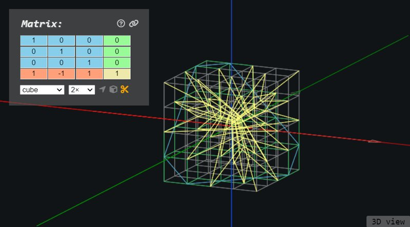

# List of My Personal Projects

*Last updated: August 16th, 2023*

Here is a document I created to track and showcase my personal projects. I spent a large fraction of my spare time on personal programming projects, out of personal passion, eager to demonstrate my ability, curiosity, altruism, artistic pursuit, and as a relaxing activity. Most of my works on GitHub are done independently. My topic of interest include rendering and visualization, geometry processing, image and signal processing, and physical simulation and control. I mostly code in C++ and Python, but I also use JavaScript for web applications.

## I'm currently working on

Summer research projects at the [Flight Simulation and Control Lab](https://www.flight.utias.utoronto.ca/fsc/)
 - One project focuses on control for racing quadrotors, where I implemented an [MPCC controller](https://arxiv.org/abs/2108.13205) and am working on improving it
 - Another study focuses on human-robot interaction, which involves designing experiments and analyzing data

Adaptive 3D mesh generation from implicit surfaces: `https://harry7557558.github.io/spirulae/meshgen3/`

Make a GUI for this [2D to 3D converter](https://github.com/harry7557558/Graphics/blob/master/simulation/fem/wasm_test/main_inflate_img.cpp)

Attempt to denoise path-traced images and run it in a web browser: [what I have so far](https://github.com/harry7557558/Graphics/blob/master/image/denoise/implicit3-alpha-field-perceptual-train.ipynb)

# Other Platforms

List of my Desmos graphs: https://harry7557558.github.io/desmos/index.html

List of my Shadertoy shaders: https://harry7557558.github.io/shadertoy/index.html

# Art and Rendering

## Spirulae Online Function Grapher (March 2022 - May 2022; October 2022; March 2023 - May 2023)

https://harry7557558.github.io/spirulae/

I was inspired by raymarching demos on Shadertoy to create a WebGL online graphing calculator for 3D implicit surfaces. I implemented an equation parser based on the Shunting-Yard algorithm that supports defining custom variables and functions. The parser generates code for a GLSL function with automatic differentiation, which is visualized by raymarching in screen space. I also independently developed a regression-based anti-aliasing technique. The function grapher was heavily updated in October 2022 to include complex arithmetic, a formula for fast gradient estimation that I derived, and improved mobile compatibility.

## “Man of La Mancha” Media Project (May 2022)

https://harry7557558.github.io/art/molm/index.html

I made this artwork for a high school English course. I procedurally modeled several objects and rendered them using Monte Carlo path tracing in WebGL. I implemented the Cook-Torrance reflectance model, refractive materials, and emissive materials.

## AVI4M Independent Study Project (November 2021 - January 2022)

https://harry7557558.github.io/AVI4M-ISP/index.html

I created this project for a high school art course. I developed an SDF visualization tool using volume rendering techniques and used it in CSG modeling. I implemented octree-based adaptive marching cubes for surface reconstruction and developed disambiguation techniques. I initially wrote path tracing rendering code from scratch. I later rendered the models in Blender to save time and meet the deadline.

## Volume Rendering Demo (October 2021)

https://harry7557558.github.io/Graphics/raytracing/webgl_volume/index.html

I played with volume rendering of medical imaging datasets in WebGL 2. I processed several popular CT and MRI scanning datasets into raw bytes using NumPy. I implemented volume rendering modes like MIP, X-ray, isosurface, volumetric integration, gradient-dependent transfer function, etc.

## IdentiEgg (July 2021)

https://harry7557558.github.io/art/dyed-egg/index.html

I was inspired by WordPress identicon to generate identicon eggs. To make the shapes of the eggs match real-world eggs, I traced real-world eggs, fitted them to a linear least squares model, and plotted the parameter points in R³. I noticed the parameters are within an ellipsoid, so I applied principal component analysis to find the equation of the ellipsoid and derived an equation to generate uniformly distributed points in it without rejection sampling. I wrote code to minimize the height of the center of mass of eggs so they can be physically rested on a plane.

## “In Your Eyes” Art Project (December 2020)

https://harry7557558.github.io/Graphics/UI/Homework/AVI3M/index.html

I generated 3D renderings of an eye model for a high school art project. The model was an implicit surface triangulated by the marching cube method, and I merged vertices that are too close with the help of the disjoint set data structure. I implemented Monte Carlo path tracing for rendering and played with specular, refractive, and glossy materials. I received a perfect score on this project.

## 2D Light Transport Simulation (March 2020)

https://github.com/harry7557558/Graphics/tree/master/raytracing/light2d

I implemented Monte-Carlo path tracing with stratified sampling to simulate light transport in 2D, and I tested it on scenes composed of refractive glass objects and light sources. My C++ code was capable of loading objects from SVG images, calculating analytical intersection to cubic Bézier curves, and determining whether a point is within a shape enclosed by Bézier splines.

## “The Glass” (May 2019)

https://github.com/harry7557558/Ray-Tracing

I created an animation for a high school art project and rendered it using ray tracing. I learned about matrix and vector algebra and object-oriented programming in C++. I also did motion capture using a cell phone camera.

# Geometry Processing

## 2D to 3D Converter (April 2023)

https://github.com/harry7557558/Graphics/tree/master/modeling/png2obj

Generate mesh -> solve $\nabla^2 h+4=0$ subject to zero boundary condition -> reconstruct surface $x^2+y^2=h$

## Implicit Mesh Smoothing Experiment (February 2022)

https://github.com/harry7557558/Graphics/tree/master/simulation/heatequ

Laplacian and Taubin smoothing; Finite difference method; Conjugate gradient and BiCGSTAB;

## Adaptive Parametric Surface Triangulation (December 2020)

https://github.com/harry7557558/Graphics/blob/master/triangulate/parametric_surface_adaptive_dist.h

Quadtree; Orthogonal approximation error; Tested on [artistic models](https://github.com/harry7557558/Graphics/blob/master/modeling/parametric/surfaces.h);

# Physics (static)

## Finite Element Analysis (December 2022 - February 2023)

https://github.com/harry7557558/Graphics/tree/master/simulation/fem/statics_le

I experimented with solving 3D trusses using the stiffness method after learning about trusses in university, and I soon moved to write C++ code from scratch to analyze stress and deflection in solids. I researched strain and stress formulations, experimented with linear and quadratic tetrahedral elements of various shapes, different preconditioners for the conjugate gradient method, and mesh generation from implicit objects. I also implemented an OpenGL GUI to visualize results.

## CIV102 Bridge Project (November 2022)

https://github.com/harry7557558/engsci-2t6/tree/master/civ102-project

This is my project for the CIV102 course that requires designing and building a matboard paper bridge to support the highest load. I wrote Python code and implemented coordinate compression for integrating piecewise polynomials, which was used to analyze the bending moment and shear profile in a beam. I used the rectpack package to set constraints to make sure all components can fit into the given matboard. I optimized the bridge using simulated annealing modified to consider gradient estimate. I built the physical bridge based on the design in a team of 3 members.

## Rigid Body Balancing (November 2020)

https://github.com/harry7557558/Graphics/tree/master/simulation/balance

I tried to find ways to place a rigid body on a plane to minimize the height of its center of mass. I did that for 2D shapes by finding the convex hull of Bézier splines. For 3D meshes, I extended the Nelder-Mead optimization algorithm to a unit sphere and used it to find a local optimal orientation.

# Physical Simulation

## Stable Fluids (August 2022 - September 2022)

https://harry7557558.github.io/Graphics/simulation/fluid_grid/jacobi_pressure/index.html

I implemented a web-based fluid simulation demo after reading Jamie Wong’s blog post. I attempted a multigrid pressure solver and vorticity confinement.

## XPBD Cloth Simulation (August 2022)

https://github.com/harry7557558/Graphics/tree/master/simulation/mass_spring/xpbd_cloth

I implemented the Extended Position Based Dynamics (XPBD) method and applied it to simulating mass-spring models and cloth models. I researched solid elasticity and implemented the energy function and its analytical gradient. I compared XPBD results with the results of a conventional semi-implicit Euler solver.

## SPH Fluid Simulation (June 2021)

https://github.com/harry7557558/Graphics/tree/master/simulation/fluid

I tried the Smoothed Particle Hydrodynamics (SPH) method for simulating 2D and 3D liquids. I implemented a particle system, a grid for fast neighbor lookup, the semi-implicit Euler solver with splitting, and iterative solvers.

# Deep Learning

## GAN Neural Network (July 2022)

https://harry7557558.github.io/Graphics/fitting/dcgan/ffhq_convtrans/webgl/index.html

I implemented a GAN neural network in PyTorch and trained it on the FFHQ face database. I manually exported it to a webpage, which loads binary weights into WebGL. I derived a mapping function that results in a uniform distribution when applied to linearly interpolated noise and used it to keep the diversity of faces in animation.

## Neural Network Written from Scratch (April 2022)

https://github.com/harry7557558/Graphics/tree/master/fitting

I tried to implement neural networks in C++ from scratch to see if they can overperform machine learning frameworks. I implemented dense, convolutional, and RBF layers, and SGD, Adam, and BFGS optimizers. I generated a grid of SDF values from a polygon mesh using breast-first search and fitted it to a SIREN neural model. I improved the algorithm by using quasi-random sampled data points in mini-batch training. I did several tests with different random number seeds and found that compared to TensorFlow, my code achieved half of the loss in a quarter of the time on average.

# Image and Signal Processing

## SVG to Desmos (March 2022)

https://github.com/harry7557558/svg-to-desmos

After seeing other people’s projects exporting SVG images to the Desmos graphing calculator, I was intrigued to write my own but focus on size optimization. I wrote a Python script that parses SVG paths into Bézier splines, and applied arc-length parameterized discretization using Gaussian quadrature and the secant method. I compressed the paths using FFT and merged shapes with the same colors using an R-tree and a greedy algorithm. I was able to fit the entire Twemoji list (4000+ emojis, 7MB SVG) into a single Desmos graph with a size of less than 3 MB.

## Symbolic Procedural Noise Analysis (August 2021)

https://github.com/harry7557558/Graphics/tree/master/modeling/procedural/noise_stat

I tried to normalize noises used in procedural modeling to a fixed mean and variance on values and gradients. To simplify work and overcome the speed issue with SymPy, I implemented a Python class for the product of polynomials and trigonometric series that supports symbolic summation, multiplication, differentiation, and integration. I used it to compute the analytical variance of several noises and their gradients and validated my results using quasi-Monte Carlo simulation in C++.

# Numerical Optimization

## Color Function Fitting (May 2021)

https://github.com/harry7557558/Graphics/tree/master/UI/color_functions

I tried to fit Wolfram colormap functions and export them to personal projects. I implemented linear least squares for polynomial and trigonometric series models with varying numbers of terms. I also fit them to a frequency-dependent trigonometric model by setting the frequency to a numerical optimization parameter.

## Fitting Bézier Curves to Parametric Curves (October 2020)

https://github.com/harry7557558/Graphics/tree/master/fitting/parametric2bezier

I tried to fit Bézier splines to mathematical parametric curves without too many pieces. I researched, implemented, and compared techniques for finding the distance from a point to a cubic Bézier spline. I initially fit the curve with Gaussian quadrature and linear least squares. I later wrote code to discretize the parametric curve with the handling for different types of singularities, while minimizing the number of curve samples.

## Ellipse Fitting Experiments (June 2020)

https://github.com/harry7557558/Graphics/tree/master/fitting/old

I derived analytical solutions to least squares fitting to 2D points for lines and circles but faced challenges for ellipses. I formulated several generalized eigenvalue problems as biased solutions and compared them with a quasi-Newton solution based on exact ellipse distance. I wrote anti-aliased rendering in C++ from scratch to visualize the results.

# Applications

## 3D Matrix Visualizer (July 2019, October 2022)

https://harry7557558.github.io/tools/matrixv.html

I wrote an online tool to visualize transformation matrices in computer graphics on an HTML5 canvas, which has several built-in 3D models and visualization of eigenpairs. It was updated in October 2022 to use the shifted QR algorithm for more accurate and stable eigenpair calculation. Currently, this tool has more than 600 Google search clicks per month according to Google Search Console.

## STL and PLY viewer (May 2020 - September 2021)

https://github.com/harry7557558/Graphics/blob/master/UI/ply_viewer.cpp

I created a 3D model viewer for personal use and maintained it for more than one year. It is based on Win32 GUI with software rasterization. It implements different shading modes, restoring the connectivity of STL models, and calculating physical quantities like the center of mass and inertia tensor using the divergence theorem.

## ASM2O Cumulative Performance Task (April 2020 - May 2020)

https://github.com/harry7557558/Graphics/tree/master/UI/Homework/ASM2O

For this high school art project, I implemented a 3D stick figure animation engine based on Win32 GUI that supports inserting, editing, and removing keyframes for each node.

## Chemical Equation Balancer (November 2019)

https://harry7557558.github.io/tools/chemequ.html

I learned the solution to homogeneous linear systems and applied it to balancing chemical equations. I implemented a chemical equation parser in JavaScript, a rational number class, and a Gaussian elimination solver. I applied integer congruence properties to find multiple solutions for linear systems with a solution space rank higher than 1.
